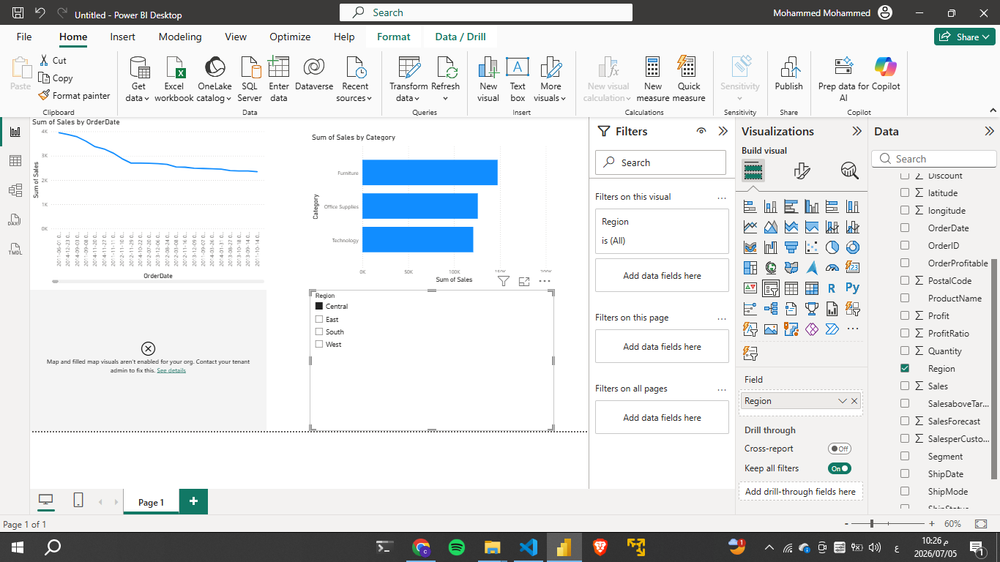

# تحليل بيانات المبيعات (TP03)

## وصف المشروع
مشروع متكامل يجمع بين قوة لغة **Python** في معالجة البيانات ومرونة **Power BI** في التمثيل البصري. 

## الملفات المرفوعة:
* `TP03_Analysis.ipynb`: نوت بوك يحتوي على كود التنظيف (Cleaning) والتحليل الاستكشافي (EDA).
* `sales-data-sample.csv`: البيانات الخام المستخدمة.
* `cleaned_data.csv`: البيانات النهائية بعد التنظيف.
* `TP03_Dashboard.pbix`: ملف لوحة التحكم التفاعلية.

## معاينة النتائج

## الأدوات المستخدمة
- **Pandas**: لتنظيف وتحويل التواريخ.
- **Seaborn & Matplotlib**: للرسوم البيانية الإحصائية.
- **Power BI Desktop**: لتصميم لوحة التحكم التفاعلية.
